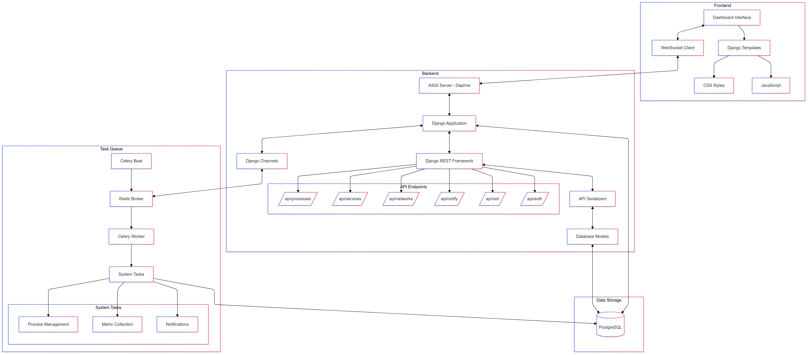
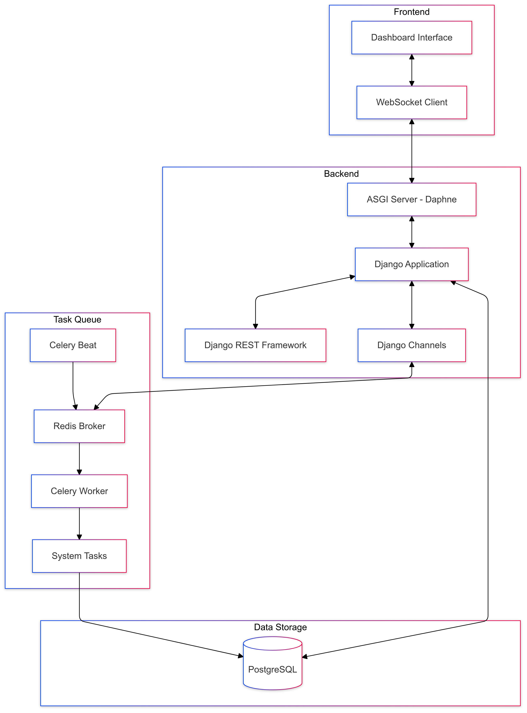

# Architecture Technique d'Hyperion

## Vue d'ensemble

### Architecture Beta

### Architecture Finale

### Architecture Finale Simplifiée

## Composants Principaux

### Backend (api/)
1. Application Django
   - [models.py](../api/models.py) : Modèles de données
   - [views.py](../api/views.py) : Vues et endpoints API
   - [serializers.py](../api/serializers.py) : Sérialiseurs REST
   - [urls.py](../api/urls.py) : Routage des URLs

2. Tâches asynchrones
   - [tasks.py](../api/tasks.py) : Tâches Celery
   - [celery.py](../api/celery.py) : Configuration Celery

3. WebSockets
   - [consumers.py](../api/consumers.py) : Consumers WebSocket
   - [routing.py](../api/routing.py) : Routage WebSocket

### Collecte de Données
1. Métriques Système
   - CPU : [`record_cpu_usage()`](../api/tasks.py)
   - Mémoire : [`record_memory_usage()`](../api/tasks.py)
   - Réseau : [`record_network_usage()`](../api/tasks.py)

2. Notifications
   - Slack : [`send_slack_notification()`](../api/tasks.py)
   - Email : [`send_email_notification()`](../api/tasks.py)

### Base de Données
#### Modèles principaux
- [`CPUUsage`](../api/models.py)
- [`MemoryUsage`](../api/models.py)
- [`NetworkUsage`](../api/models.py)
- [`StorageUsage`](../api/models.py)

#### Relations
Chaque métrique est horodatée et liée à son système source

### Flux de Données
1. Collecte
   - Tâches Celery périodiques
   - Métriques en temps réel

2. Stockage
   - PostgreSQL pour les données persistantes
   - Redis pour le cache et messages

3. Distribution
   - API REST pour les requêtes standard
   - WebSockets pour les mises à jour en temps réel

