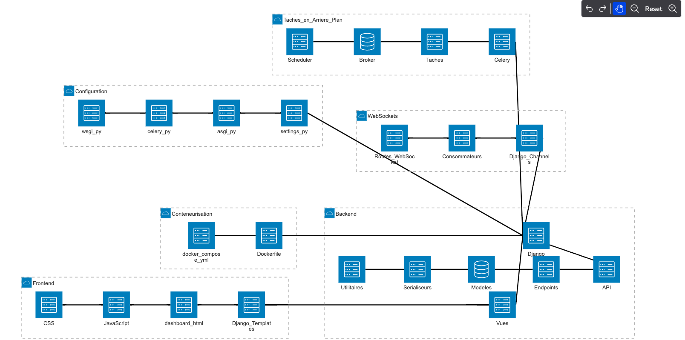

Plan de développement pour ton projet Hyperion, en tenant compte des fonctionnalités décrites dans la documentation :

L'application **Hyperion** est un outil avancé de surveillance et de gestion pour systèmes informatiques, principalement destiné à simplifier et centraliser les tâches d’administration système. Voici ses principales utilités :

### **1. Monitoring système en temps réel**
   - Suivre les performances (CPU, mémoire, stockage, réseau, température des composants).
   - Afficher des graphiques interactifs pour identifier rapidement les problèmes.

### **2. Gestion simplifiée**
   - **Processus** : Lister, trier, et gérer les processus (arrêter, modifier la priorité, etc.).
   - **Services** : Démarrer, arrêter ou redémarrer des services système via une interface intuitive.
   - **Fichiers** : Naviguer, déplacer, renommer et gérer des fichiers avec une fonction de glisser-déposer.

### **3. Surveillance réseau**
   - Visualiser les interfaces réseau et leurs utilisations.
   - Bloquer des IP ou des ports en cas de connexion suspecte.

### **4. Sécurité et supervision**
   - Authentification 2FA pour protéger l’accès.
   - Supervision à distance de plusieurs machines via SSH.

### **5. Automatisation et historique**
   - Configurer et gérer des tâches récurrentes (ex. cron jobs).
   - Conserver des données historiques pour générer des analyses prédictives (comme la saturation future des ressources).

### **6. Notifications proactives**
   - Alerter en temps réel via Slack, email ou d’autres outils en cas de dépassement de seuil critique (CPU élevé, stockage insuffisant, etc.).

### **Cibles principales :**
   - **Administrateurs système** : Gérer des serveurs locaux et distants efficacement.
   - **Petites et moyennes entreprises** : Centraliser la surveillance sans investir dans des solutions complexes.
   - **Développeurs et équipes IT** : Prévenir les interruptions grâce à des alertes et analyses prédictives.

En bref, **Hyperion** permet une gestion simplifiée, sécurisée et visuellement intuitive des systèmes informatiques, améliorant ainsi la productivité des administrateurs tout en réduisant les risques de défaillances.

---

### **Étape 1 : Planification et configuration**
1. **Analyse des besoins**
   - Lister toutes les fonctionnalités : tableau de bord, gestion des processus, services, fichiers, réseau, statistiques historiques, sécurité, etc.
   - Identifier les priorités.
   - Établir des contraintes techniques et fonctionnelles.

2. **Choix des technologies**
   - **Backend** : Django, Django REST Framework (DRF), Celery pour les tâches en arrière-plan.
   - **Frontend** : React.js ou Vue.js avec des graphiques interactifs (Chart.js ou D3.js).
   - **Base de données** : PostgreSQL pour les données historiques et systèmes.
   - **WebSockets** : Django Channels pour les mises à jour en temps réel.
   - **Supervision distante** : Utilisation de SSH (paramiko/fabric).
   - **Notifications** : Uptime Kuma pour le monitoring et les webhooks.

3. **Environnement de développement**
   - Configurer Docker pour une isolation et un déploiement simple.
   - Mise en place de Git pour le contrôle de version.
   - Installer un environnement de test (pytest, Selenium pour l’UI).

---

### **Étape 2 : Développement backend**
1. **Création des API**
   - Endpoints DRF pour chaque module : `/processus`, `/services`, `/network`, etc.
   - Sécuriser les endpoints (authentification à deux facteurs, permissions basées sur les rôles).

2. **Gestion des processus et services**
   - Intégrer `psutil` pour interagir avec le système.
   - Ajouter des commandes système pour gérer les services (`systemctl`, `os.subprocess`).

3. **Stockage des données historiques**
   - Créer des modèles pour CPU, mémoire, réseau, etc.
   - Planifier les tâches d’enregistrement périodiques avec Celery.

4. **Notifications**
   - Configurer Celery avec un broker (RabbitMQ ou Redis).
   - Mettre en place les webhooks pour Slack/email.

5. **Supervision à distance**
   - Implémenter les connexions SSH via paramiko.
   - Ajouter des endpoints pour monitorer les machines distantes.

---

### **Étape 3 : Développement frontend**
1. **Dashboard principal**
   - Intégrer les widgets (modulaires et personnalisables).
   - Ajouter des graphes interactifs pour CPU, mémoire, etc.

2. **Gestion des thèmes**
   - Implémenter un mode clair/sombre et des palettes personnalisables.

3. **Réactivité**
   - Rendre l’application mobile-friendly avec un design responsive.

4. **Gestion des processus et services**
   - Intégrer des actions en direct avec WebSockets (via Django Channels).

5. **Configuration utilisateur**
   - Formulaires pour gérer les utilisateurs et leurs permissions.

---

### **Étape 4 : Sécurité et tests**
1. **Authentification**
   - Ajouter 2FA avec `django-two-factor-auth`.
   - Gérer les rôles utilisateurs (lecture seule, admin).

2. **Tests unitaires et d’intégration**
   - Vérifier les endpoints API.
   - Tester les flux utilisateur (UI/UX).

3. **Optimisation**
   - Monitorer les performances (Django Prometheus).
   - Optimiser les requêtes et les tâches de fond.

---

### **Étape 5 : Déploiement**
1. **Mise en production**
   - Utiliser un serveur comme Nginx pour servir l’application.
   - Configurer Docker Compose pour orchestrer les services.
   - Automatiser les déploiements avec CI/CD.

2. **Documentation**
   - Rédiger la documentation technique et utilisateur.

3. **Suivi**
   - Mettre en place des outils de monitoring (comme Grafana avec Prometheus).

---

Ce plan est modulable selon tes priorités et contraintes spécifiques. Si besoin, je peux détailler certaines étapes ou t’aider à structurer un sprint de développement.

# diagramme Architecture
```mermaid
architecture-beta
    group backend(cloud)[Backend]
    group frontend(cloud)[Frontend]
    group background_tasks(cloud)[Taches_en_Arriere_Plan]
    group websockets(cloud)[WebSockets]
    group configuration(cloud)[Configuration]
    group containerization(cloud)[Conteneurisation]

    service django(server)[Django] in backend
    service api(server)[API] in backend
    service endpoints(server)[Endpoints] in backend
    service models(database)[Modeles] in backend
    service views(server)[Vues] in backend
    service serializers(server)[Serialiseurs] in backend
    service utilities(server)[Utilitaires] in backend

    service templates(server)[Django_Templates] in frontend
    service dashboard_html(server)[dashboard_html] in frontend
    service javascript(server)[JavaScript] in frontend
    service css(server)[CSS] in frontend

    service celery(server)[Celery] in background_tasks
    service tasks(server)[Taches] in background_tasks
    service broker(database)[Broker] in background_tasks
    service scheduler(server)[Scheduler] in background_tasks

    service channels(server)[Django_Channels] in websockets
    service consumers(server)[Consommateurs] in websockets
    service websocket_routes(server)[Routes_WebSocket] in websockets

    service settings(server)[settings_py] in configuration
    service asgi(server)[asgi_py] in configuration
    service celery_config(server)[celery_py] in configuration
    service wsgi(server)[wsgi_py] in configuration

    service dockerfile(server)[Dockerfile] in containerization
    service docker_compose(server)[docker_compose_yml] in containerization

    django:L -- R:views
    views:L -- R:templates
    templates:L -- R:dashboard_html
    dashboard_html:L -- R:javascript
    javascript:L -- R:css

    django:L -- R:api
    api:L -- R:endpoints
    endpoints:L -- R:models
    models:L -- R:serializers
    serializers:L -- R:utilities

    django:L -- R:celery
    celery:L -- R:tasks
    tasks:L -- R:broker
    broker:L -- R:scheduler

    django:L -- R:channels
    channels:L -- R:consumers
    consumers:L -- R:websocket_routes

    django:L -- R:settings
    settings:L -- R:asgi
    asgi:L -- R:celery_config
    celery_config:L -- R:wsgi

    django:L -- R:dockerfile
    dockerfile:L -- R:docker_compose

```

Image de l'architecture de l'application Hyperion
